# Android APK Setup on Windows

Run Android apps (APKs) on Windows using the Google Play Games Developer Emulator with ADB, plus optional root via Magisk.

This repo turns the setup into a clean, repeatable workflow without relying on heavy traditional Android emulators.

## Goal

- Run Android on Windows
- Install and use APK files
- Keep the setup lightweight
- Optionally enable root with Magisk

## Requirements

1. Google Play Games Developer Emulator
   Download from the official Android Developers page:
   [Google Play Games Developer Emulator](https://developer.android.com/games/playgames/emulator)

   - Download the stable edition
   - Install it
   - Launch it once
   - Close it completely afterward, including from Task Manager if needed

2. Magisk APK
   Download the latest official release:
   [Magisk Releases](https://github.com/topjohnwu/magisk/releases)

3. `hpesuperpower`
   Download the latest release ZIP:
   [MagiskOnGooglePlayGames Releases](https://github.com/chsbuffer/MagiskOnGooglePlayGames/releases)

4. ADB platform-tools
   Download the official ZIP:
   [Android SDK Platform-Tools](https://developer.android.com/tools/releases/platform-tools)

5. Aurora Store APK (optional)
   Download the latest APK:
   [Aurora Store Releases](https://www.auroraoss.com/files/AuroraStore/Release)

## Recommended Folder Layout

Create a working folder anywhere you like. In this guide, we will call it `emulator-windows` and place it inside `Documents`.

```text
emulator-windows/
├── hpesuperpower-1.2.1/
│   ├── hpesuperpower.exe
│   └── Magisk-v30.7.apk
├── platform-tools/
│   └── adb.exe
└── apks/
    ├── app1.apk
    ├── AuroraStore.apk
    └── Magisk-v30.7.apk
```

Notes:

- Keep a copy of `Magisk.apk` inside the `hpesuperpower` folder for patching.
- Keep APKs you want to install inside `apks/` for organization.
- You can still install APKs from any path with `adb install`.

## Setup

### 1. Install Google Play Games Developer Emulator

- Install the emulator
- Launch it once
- Close it fully

If it stays running in the tray, end it before moving on.

### 2. Add ADB to PATH

1. Launch the emulator once from the hidden taskbar icons area.
2. Locate your `platform-tools` folder.
3. Right-click the folder and choose `Copy as path`.
4. Open `Edit the system environment variables` from the Start menu.
5. Click `Environment Variables`.
6. Under `User variables`, select `Path`.
7. Click `Edit`.
8. Click `New`.
9. Paste the full `platform-tools` path.
10. Click `OK` to save all dialogs.

### 3. Test ADB

Open Command Prompt and run:

```powershell
adb devices
```

Expected output:

```text
localhost:xxxx device
```

If you see a connected device entry, ADB is working.

### 4. Optional Root Setup with Magisk

Skip this section if you do not need root.

1. Open Command Prompt as Administrator in the `hpesuperpower` folder.
2. Change into that folder:

```powershell
cd path\to\emulator-windows\hpesuperpower-x.x.x
```

3. Patch the emulator with your real Magisk APK version:

```powershell
hpesuperpower.exe magisk Magisk-vXX.XX.apk --dev
```

Use the actual filename you downloaded, for example:

```powershell
hpesuperpower.exe magisk Magisk-v30.7.apk --dev
```

## Installing APKs

Put your APK files inside the `apks/` folder if you want to keep everything organized.

### Method 1: ADB

This is the most reliable method.

```powershell
adb install "full\path\to\app.apk"
```

Example:

```powershell
adb install "C:\Users\YourName\Documents\emulator-windows\apks\app1.apk"
```

### Method 2: Aurora Store

Install Aurora Store with ADB:

```powershell
adb install "C:\Users\YourName\Documents\emulator-windows\apks\AuroraStore.apk"
```

Then open Aurora Store inside the emulator and sign in using the mode you prefer.

### Method 3: Browser Inside the Emulator

- Open Chrome or another browser inside the emulator
- Download the APK directly
- Install it manually

## Notes

- The Play Store experience is limited in this environment
- Aurora Store is usually better for daily app installs
- ADB is the most dependable install path

## Daily Workflow

1. Launch the emulator
2. Install apps with ADB or Aurora Store
3. Open and use the installed apps

## Common Issues

### Device Not Detected

```powershell
adb kill-server
adb start-server
adb devices
```

### APK Install Fails

Try reinstalling with replace mode:

```powershell
adb install -r app.apk
```

### App Installed but Not Showing

List installed packages:

```powershell
adb shell pm list packages
```

Launch an app manually:

```powershell
adb shell monkey -p package.name -c android.intent.category.LAUNCHER 1
```

## Result

After setup, you will have:

- Android running on Windows
- APK installation support
- Optional Magisk root
- A lighter alternative to traditional emulators

## Screenshots

Place your screenshots in [`assets/screenshots/`](assets/screenshots).

If you save them with the names below, you can simply uncomment the matching image lines and they will render on GitHub:

```md
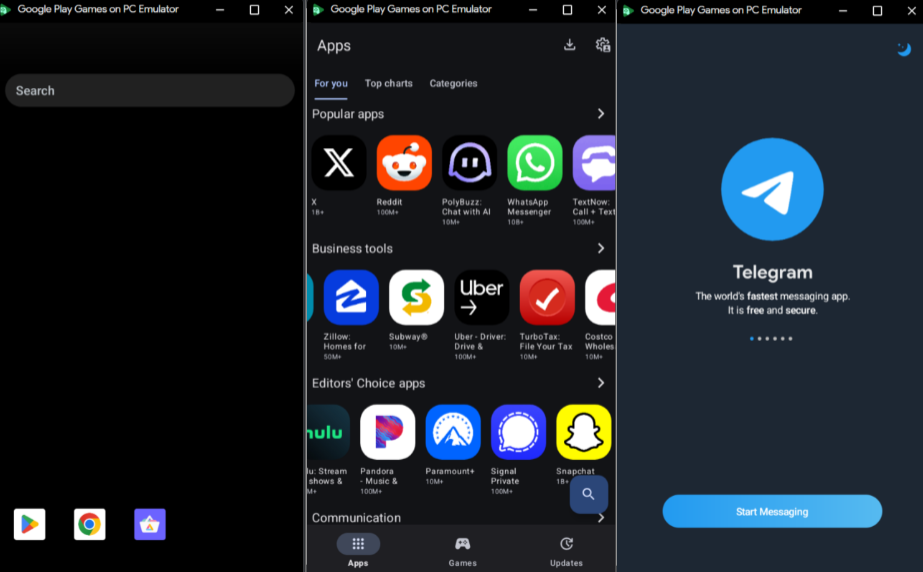
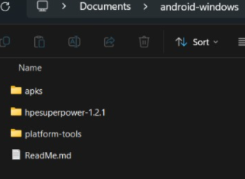
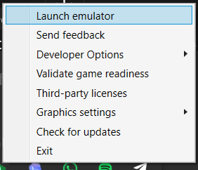
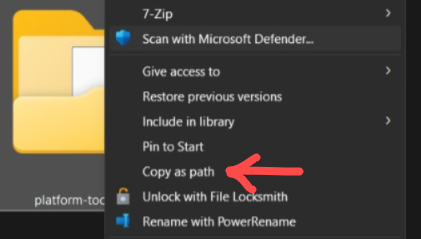
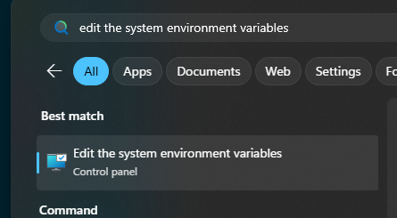
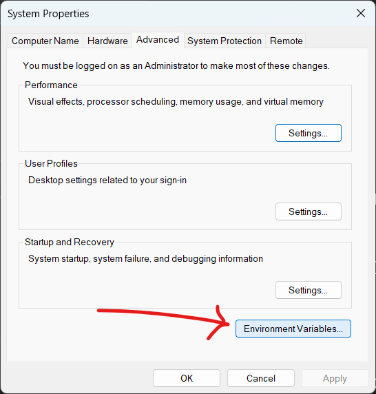
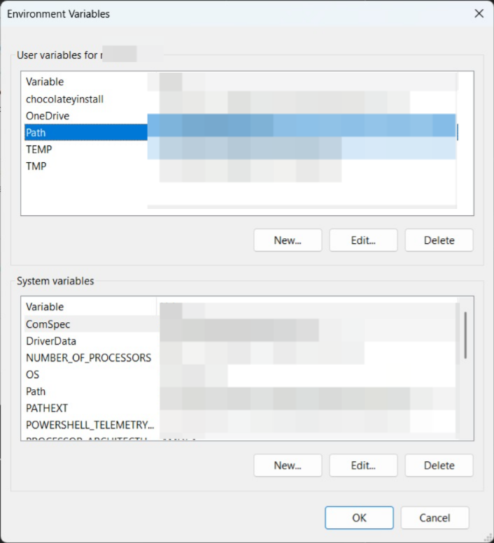
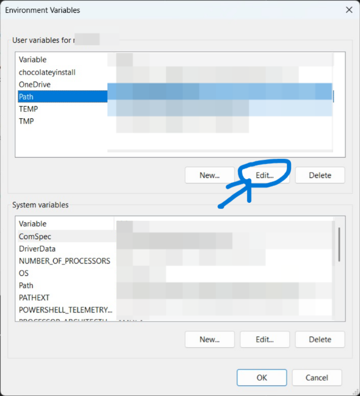
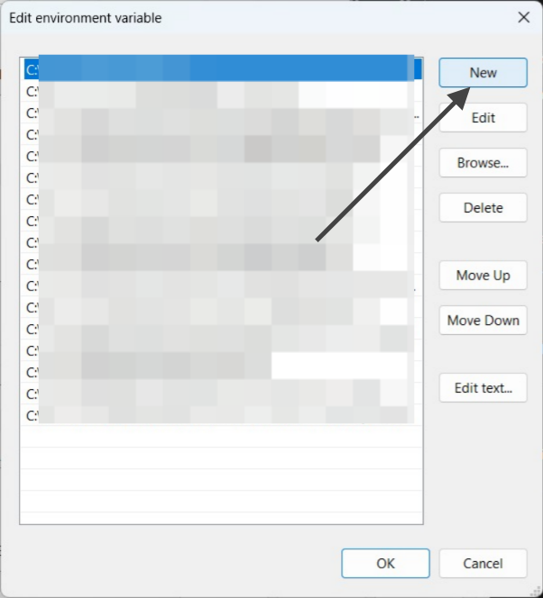
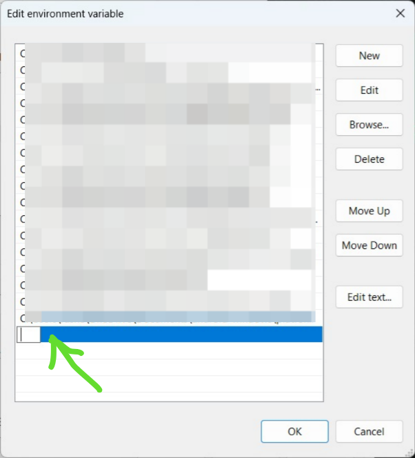
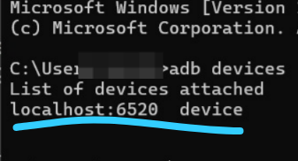
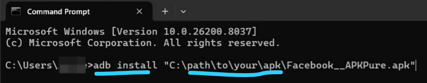
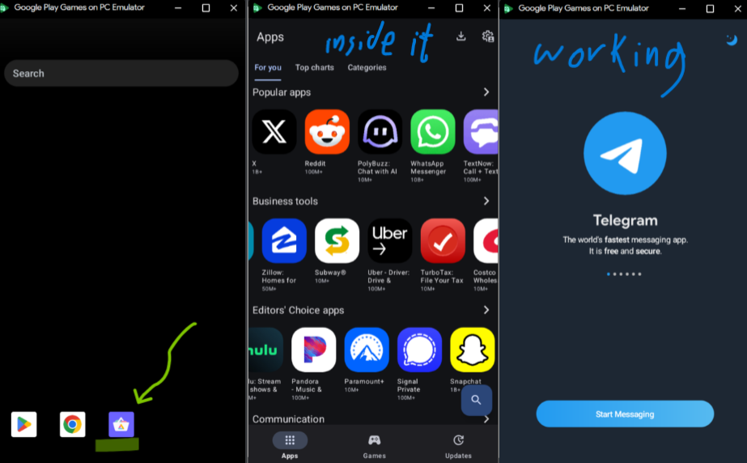
```

## Disclaimer

Rooting or patching the emulator may break in future releases and can carry security or stability risks. Only do it if you understand the tradeoffs.
